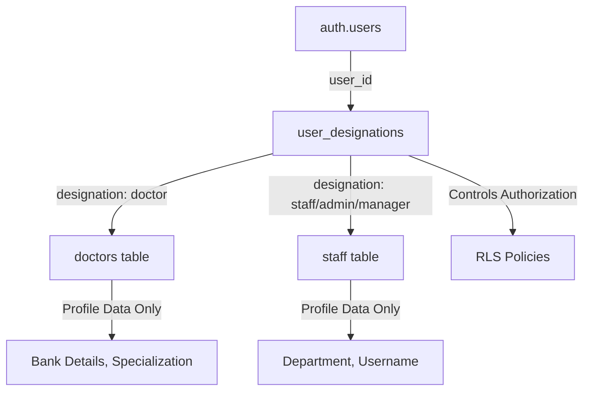

# System Architecture Documentation

## User Roles & Designations

### Single Source of Truth: `user_designations` Table

The system uses **`user_designations`** as the single source of truth for all user roles and authorization decisions.

#### Role/Designation Hierarchy



### Tables & Their Purposes

| Table | Purpose | Authorization? | Notes |
|-------|---------|----------------|-------|
| `user_designations` | **AUTHORIZATION** | ✅ YES | Single source of truth for roles |
| `staff` | Profile data | ❌ NO | `staff.role` is for display only |
| `doctors` | Profile data | ❌ NO | No role field needed |
| `profiles` | DEPRECATED | ❌ NO | Will be removed |
| `user_sessions` | Session tracking | Caching only | `role` field cached from `user_designations` |

### Authorization Pattern

**✅ CORRECT - Use `has_designation()` function:**
```sql
-- RLS Policy Example
CREATE POLICY "Admins can view all"
ON some_table
FOR SELECT
USING (has_designation(auth.uid(), 'admin'::app_designation));
```

**❌ WRONG - Don't check tables directly:**
```sql
-- DON'T DO THIS (causes recursive RLS issues)
CREATE POLICY "Bad policy"
ON some_table
FOR SELECT  
USING ((SELECT role FROM profiles WHERE user_id = auth.uid()) = 'admin');
```

### User Creation Flow

1. **Create auth user** (`auth.users`)
2. **Insert designation** (`user_designations`) - **REQUIRED**
3. **Insert profile** (`staff` or `doctors`) - profile data
4. **Trigger syncs designation** automatically for consistency

```typescript
// Correct flow in edge function
const { data: authUser } = await supabase.auth.admin.createUser({ email, password });

// Insert designation (REQUIRED for authorization)
await supabase.from('user_designations').insert({
  user_id: authUser.user.id,
  designation: 'staff' // or 'doctor', 'admin', etc.
});

// Insert profile data
await supabase.from('staff').insert({
  user_id: authUser.user.id,
  staff_code, username, full_name, role, // role is for display only
  ...bankDetails
});
```

### Data Fetching Pattern

**Use the helper function for complete user profiles:**

```typescript
import { getUserProfile } from '@/lib/userProfile';

// Gets complete profile based on designation
const profile = await getUserProfile(userId);
// Returns: { designation, user_id, code, full_name, bank_details, ... }
```

## Email Validation

### Real-time Validation with Debouncing

Both `StaffManagement` and `DoctorManagement` implement real-time email validation:

- **Debounced**: 500ms delay after user stops typing
- **Visual feedback**: Red border + inline error message
- **Submit prevention**: Button disabled if email error exists

```typescript
useEffect(() => {
  if (!formData.email.trim() || formData.email === editingStaff?.email) {
    setEmailError('');
    return;
  }

  const timeoutId = setTimeout(async () => {
    const { data } = await supabase
      .from('staff')
      .select('id, email')
      .eq('email', formData.email.trim())
      .maybeSingle();
    
    if (data) {
      setEmailError('This email is already registered');
    } else {
      setEmailError('');
    }
  }, 500);

  return () => clearTimeout(timeoutId);
}, [formData.email, editingStaff]);
```

## Security Best Practices

### ✅ DO:
- Use `has_designation()` for all authorization checks
- Use Security Definer functions for privileged operations
- Enable RLS on all tables containing user data
- Validate emails client-side for UX, server-side for security
- Use `user_designations` as single source of truth

### ❌ DON'T:
- Check `profiles.role` or `staff.role` for authorization
- Query user tables directly in RLS policies (causes recursion)
- Store roles in localStorage/sessionStorage for auth checks
- Skip server-side validation relying only on client checks
- Create multiple sources of truth for roles

## Database Triggers

### Automatic Designation Sync

```sql
-- When staff is created, automatically create user_designations
CREATE TRIGGER sync_staff_designation_trigger
  AFTER INSERT ON public.staff
  FOR EACH ROW
  EXECUTE FUNCTION public.sync_staff_designation();

-- When doctor is created, automatically create user_designations  
CREATE TRIGGER sync_doctor_designation_trigger
  AFTER INSERT ON public.doctors
  FOR EACH ROW
  EXECUTE FUNCTION public.sync_doctor_designation();
```

### Orphan Prevention

```sql
-- Prevent deletion of user_designations while staff/doctor exists
CREATE TRIGGER prevent_designation_orphan_trigger
  BEFORE DELETE ON public.user_designations
  FOR EACH ROW
  EXECUTE FUNCTION public.prevent_user_designation_orphan();
```

## Migration Notes

### Data Safety

Before making any destructive changes:

1. ✅ All `staff` users have corresponding `user_designations`
2. ✅ All `doctors` have corresponding `user_designations`
3. ✅ Triggers are in place to maintain consistency
4. ✅ Helper functions exist for consolidated data access

### Deprecation Path

1. **Phase 1**: ✅ Add triggers and helper functions (DONE)
2. **Phase 2**: ✅ Update client code to use `getUserProfile()` (IN PROGRESS)
3. **Phase 3**: Update all RLS policies to use `has_designation()`
4. **Phase 4**: Mark `profiles` table as deprecated
5. **Phase 5**: After 3+ months, remove `profiles` table

### Verification Query

```sql
-- Check for orphaned records
SELECT 
  (SELECT COUNT(*) FROM staff WHERE user_id IS NOT NULL 
   AND NOT EXISTS (SELECT 1 FROM user_designations WHERE user_id = staff.user_id)) as orphaned_staff,
  (SELECT COUNT(*) FROM doctors WHERE user_id IS NOT NULL
   AND NOT EXISTS (SELECT 1 FROM user_designations WHERE user_id = doctors.user_id)) as orphaned_doctors,
  (SELECT COUNT(*) FROM user_designations WHERE NOT EXISTS (
    SELECT 1 FROM staff WHERE user_id = user_designations.user_id
    UNION ALL
    SELECT 1 FROM doctors WHERE user_id = user_designations.user_id
  )) as orphaned_designations;
```

Expected result: All values should be 0.
